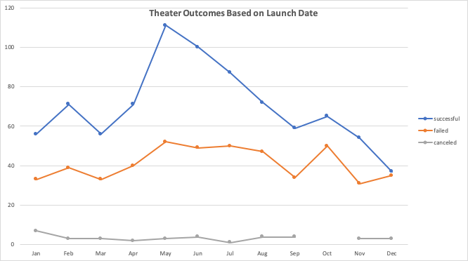
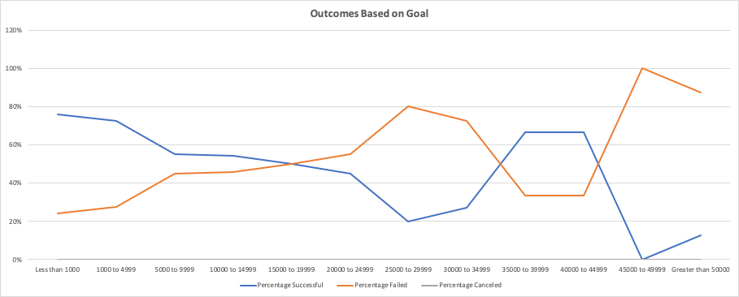
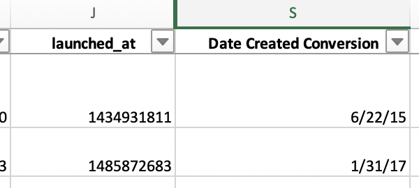
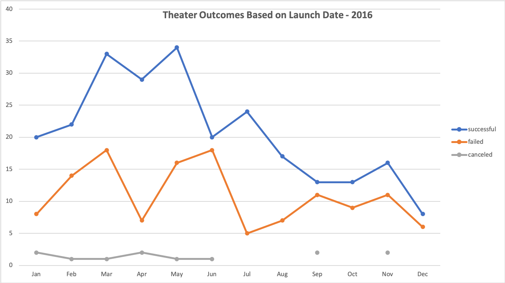
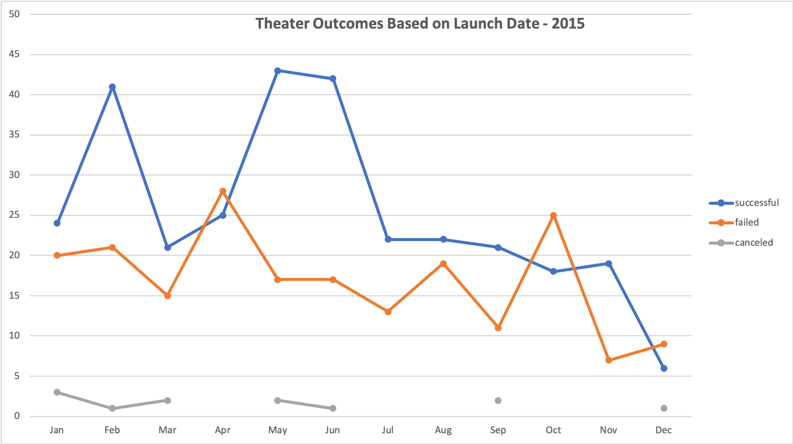
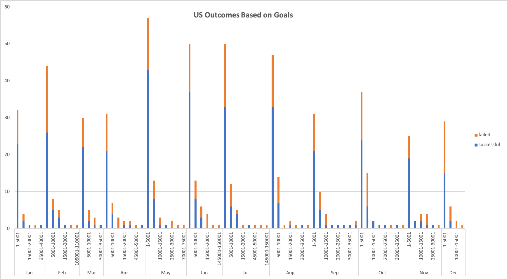
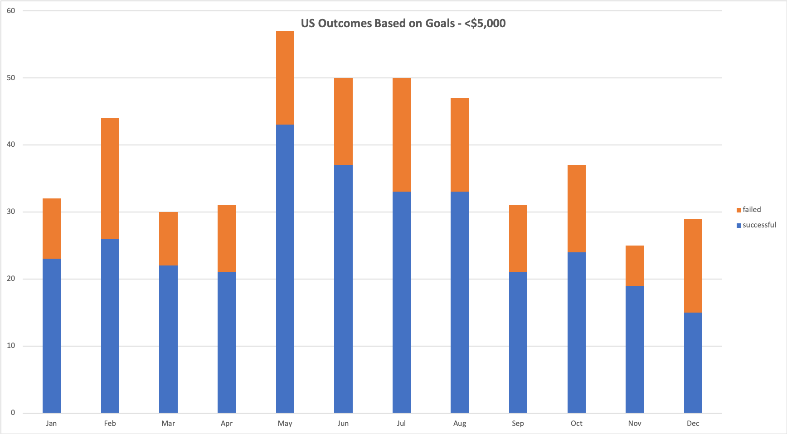

# Kickstarter Funding Goals Analysis

## 1. Overview of Project
Why do some Kickstarter campaigns succeed and some don't? Louise poses this question after her play _Fever_ came close but did not meet its funding goal. We will examine this by analyzing the outcomes of different campaigns and how they performed in relation to their **launch dates** and their **funding goals** using a dataset from various Kickstarter campaigns.
[Kickstarter_Challenge.xlsx](Kickstarter_Challenge.xlsx)

## 2. Analysis and Challenges

### Analysis of Outcomes Based on Launch Date
- The key factor we are looking to analyze here is the correlation between launch date and funding outcome.  Did Louise launching her campaign in June have an affect on her campaign failing?  

- Since _Fever_ is a play in the theater category, we looked to filter the dataset to theater so that we are analyzing relative campaigns.   We decided to group the launch date into months as analyzing by years or quarters seemed too broad and by actual dates seemed too narrow.  Once we narrowed the data to review based on category and months, we were able to utilize the **line graph** to plot the successful, failed and canceled outcomes accordingly.

### Analysis of Outcomes Based on Goals
- In order to analyze outcomes based on funding goals, we wanted to group the data into dollar-amount ranges so that we are not working with overwhelming amounts of unique raw data. We created 12 ranges and utilized the **COUNTIFS** function to determine the number of successful, failed and canceled campaigns.  Since we wanted to analyze relevant data to Louise's play _Fever_, we broke down the category further to focus on the play subcategory.  

- Once we summed up the total projects by dollar-amount ranges using the **SUM** function, we created the percentages column for each of the outcomes.  Adding these columns helped create a more digestible visualization of the analysis.  For this visualization, we used the **line graph** showing the outcome percentages by goal dollar-amount ranges.

### Challenges and Difficulties Encountered
- The main challenge was working with a large dataset that included information that was irrelevant to the project.  The key was sorting through the data to focus on useful information which included adding additional columns to breakdown existing data and converting certain columns to readable formats.  For example, the dataset contained Unix epoch which is not easily recognizable so converting this the month/date/year format made for more useful data.

## 3. Results

### Two conclusions for Outcomes based on Launch Date
- Lauching a Kickstarter campaign in the month of May for the theater category had the most amount of successful campaigns.  From this, it can be concluded that instead of launching in June, Louise should have launched a month earlier to have a better chance for a successful outcome. However, May is also when the most number of theater campaigns failed so if you look at the failed data, May does not seem like the best month to launch a campaign.  Therefore, the first conclusion is that this current **Outcomes based on Launch Date** information is not sufficient for a thorough analysis.  Using percentage to total could have made the analysis more comprehensive to account for the different number of campaigns per month so that the numbers are not skewed.  For example, though May has the most number of failed campaigns at 52, the percentage of failed campaigns for the month is at 31%.  Whereas November has the least number of failed campaigns at 31 but the percentage is higher at 35%.  With this additional information, it still seems that May could be a good month to launch a Kickstarter campaign for theater.     

- The second conclusion that can be made for **Outcomes based on Launch Date** is that campaigns for theater tend to be more successful during the summer months (May, June, July) than others especially those launched during the winter months.  From this, it can be concluded that Louise having launched her campaign during June gave her campaign the best chance for success.  However, we are again missing relevant information to do a comprehensive analysis.  The current analysis includes data from 2009 to 2017, however it would be useful to look at data per year.  

- In 2016, when Louise ran her campaign, June was not a good month as the success to failure ratio was almost equal.

- Wherease in the year 2015, June was a great month to launch a campaign.  

### One conclusion for Outcomes based on Goals
- Based on **Outcomes based on Goals** it can be concluded that Louise's campaign goal of $2,885 was the right amount as there was a high success rate of 73% in this dollar-amount range.  However, analysis looking at just the dollar-amount is very limiting as other factors could affect why Louise's campaign failed.  It would be useful to look at what year and/or month these outcomes fell in.  It would also be beneficial to breakdown the data by country.  Louise's campaign was based in the US in USD.  This current model factors in all territories and all currencies so the data is misleading as dollar-amount ranges in USD is not equal to a range in GBP.

### Limitations of this dataset
- In this project, Louise's play _Fever_ did not meet its funding goals and she wanted to know how different campaigns fared in relation to their launch dates and funding goals. Do we have enough information in our dataset to comprehensively answer this question?  From the current dataset, it is difficult to make a correlation between the results of other campaigns to her campaign without a few assumptions.  To provide a complete recommendation we would want to see the location of the play as campaigns by country is too broad.  For example, if the play is located in NYC vs Honolulu, there will most likely be a difference in goal-amounts and outcomes.  Additionally information or dollar-amounts spent on marketing the campaign could be helpful as there is most likely a correlation between visibility of the campaign and the outcome.  

### Other possible tables and/or graphs:
- To specifically answer Louise's question, you could create a table and a **stacked bar graph** showing the outcomes based on goal dollar-amount and launch dates for the play subcategory in the US.

- However, the graph above though providing a lot of useful information is hard to read.  To simplify, we can move the goal dollar-amount to be a filter in the table so that we can breakdown the graph by the relevant amount to Louise's play _Fever_, in this case campaigns with goal amounts less than $5,000.  Here you can conclude that Louise had a better chance for success if she launched her campaign during the month of May.

